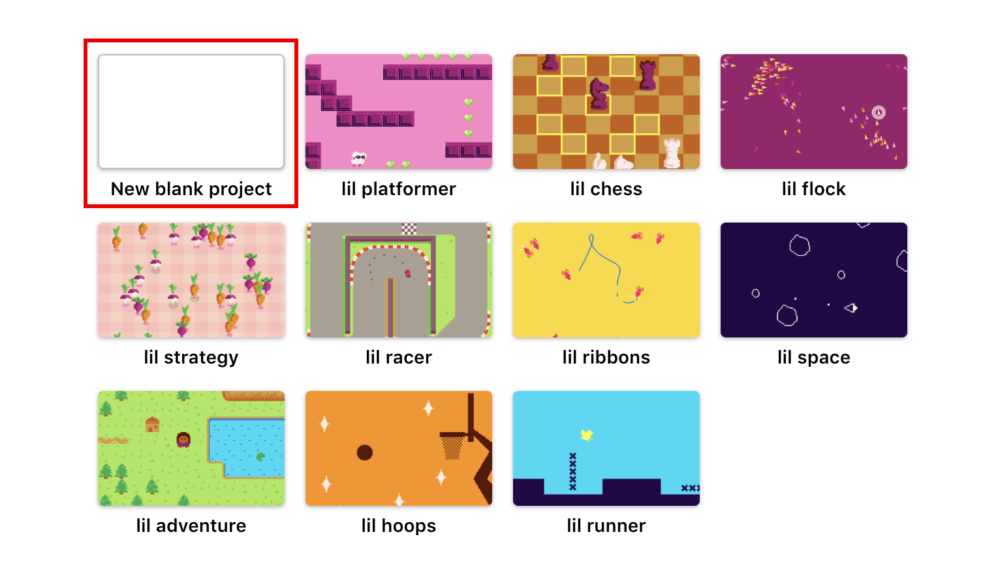
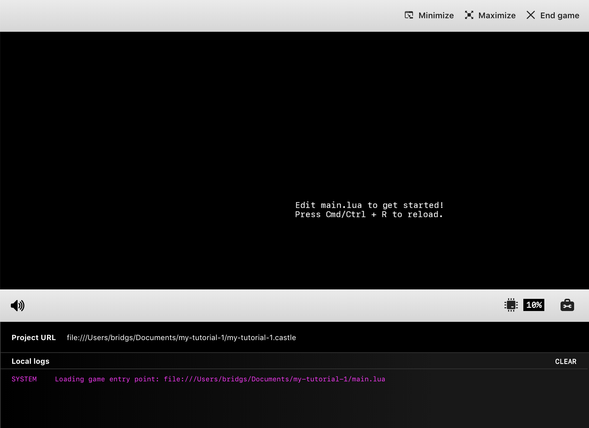

# Tutorial 1

Welcome to the first in a series of tutorials about making games on Castle! In this series we'll first get started with the basics: getting Castle setup, and learning how to draw graphics and react to user input, which form the basis of games. After that, we'll get into the unique social features offered by Castle's platform. These include displaying user avatars in your game, allowing your game to make posts and save data in Castle's database, and making your game multiplayer.

## Learning goals

Here's a list of things that we can hope to learn in this first tutorial:

- Installing and setting up Castle
- Software you will need other than Castle itself
- Starting a new project
- Drawing shapes
- Reacting to input
- Drawing images
- Publishing your game to Castle

## Installing and setting up Castle

*You can skip this step if you've already installed Castle and have a user account.*

You can download the latest release of Castle from Castle's [home page](https://castle.games/).

If you're on **Windows**, this will give you a file named like 'Castle-\<version\>-Setup.exe', which you can launch and follow the instructions to install Castle.

For **macOS**, you will get a file like 'Castle-\<version\>.zip'. Extract this and put the 'Castle.app' file inside in your macOS Applications folder. Putting it in the Applications folder is necessary for auto-updates to work properly.

From now on, Castle can automatically check for updates, prompt you and update itself. You won't have to repeat the installation process on this computer!

When you first launch Castle, you will see the following screen:


Follow the instructions to create an account (or sign in if you happen to have an account already). Having an account on Castle allows users to have profiles for their games, interact in chat and play multiplayer games.

You should now be ready to explore and play games on Castle. You probably came to this tutorial to learn how to make your own games, so let's learn how to do that!

## Software you will need other than Castle itself

### Code editor

Currently, games for Castle are made using the [Lua](https://www.lua.org/start.html) programming language. If you're familiar with programming already, the language should be easy to learn while making games on Castle. To write Lua code, you will need a code editor. The Castle team recommends [VS Code](https://code.visualstudio.com/) with the [vscode-lua](https://marketplace.visualstudio.com/items?itemName=trixnz.vscode-lua) extension. If you're already familiar with a code editor that supports Lua, you could continue using it! Vim, Notepad++, Sublime Text, Emacs are all popular code editors that have Lua support. In some cases these editors may need a plugin or some additional setup to enable syntax highlighting for Lua.

### Image editor (optional)

Usually game elements are displayed using images. For example, if you're making a Pac-Man clone, you may want to draw an image for Pac-Man, one image for each kind of ghost, and so on. For this you will need an image editor. Any editor that exports common file formats such as JPEG or PNG will do (PNG is recommended to to retain image quality).

You can do without an image editor if you find pre-made images on the web, or if you want to just render abstract shapes such as circles and rectangles which you can do with pure code.

Now that we've gotten that out of the way, let's actually start our Castle game project!

## Starting a new project

In Castle's sidebar, click 'Create' to navigate to the Create screen:


On the Create screen, you will be presented with many options for starting a new project or opening an existing one. These include templates that start your game with some pre-existing code and images. In this tutorial we want to learn how to write our own code to start things off, so let's click on the 'blank' option:



On the next screen, you will have a chance to set your project's name. You may also want to navigate to a different directory to save your project's files in. Under this directory, Castle will create a *new directory* for your project, and the project's files wil reside within that new directory. Projects usually involve at least one '.castle' file and one '.lua' file, if not more files, so it makes sense to have a separate directory per-project. Once you've picked the options you want, click 'Create Project':


Once you do this, you will be greeted with the following screen, where you can click 'Open Project' to launch your project in it's current form:


The initial version of your project should look like this:



We're now ready to start writing some code! Open the 'main.lua' file under the project directory in your code editor and check out the current state of the code: 


This code will make sense to you real soon--or it may make sense to you already! The project is currently only showing text, so let's start by making it draw some shapes!

## Drawing shapes

The most basic type of drawing involves drawing shapes such as circles, rectangles and ellipses. Let's start off by drawing a circle. Delete all the code currently in 'main.lua' and replace it with just the following 3 lines (we'll dig in and actually understand the code soon):

```lua
function love.draw()
    love.graphics.circle('fill', 40, 40, 20)
end
```

Save the file. Now hit the 'Reload Project' button in Castle, or hit 'Ctrl + R' (on Windows) or 'Cmd + R' (on macOS). Castle will reload your project, using your modified code. Make sure you saved the new contents of the file first, or Castle won't be able to pick up the changes you made in your code editor! You should now see the following:


Congratulations! You've made your first Castle game code change!

Now let's take a moment to understand the code we wrote. First, we define a function named `love.draw`. What is love? In this case it's [LÖVE](https://love2d.org/), the Lua game framework Castle has built-in to let you code games. LÖVE has a ton of features and functions, which you can learn more about on [its wiki](https://love2d.org/wiki/Main_Page). There's a lot there, but you don't have to worry about digging into it just yet. This tutorial will explain each of the LÖVE features used as they come up. But it's good to know that all of the other LÖVE features are available in Castle, for when you want to go beyond this tutorial and expand your games on your own!

So, back to `love.draw`. When you define the `love.draw` function, LÖVE understands that it needs to call this function whenever it's drawing the screen to display your game. This happens 60 times a second, to keep your game running smoothly. You can [read more about `love.draw`](https://love2d.org/wiki/love.draw) in the LÖVE wiki. From now on, we'll link LÖVE function names to the relevant wiki section for when you want to dig deeper.

Inside `love.draw`, we use the [`love.graphics.circle`](https://love2d.org/wiki/love.graphics.circle) function to draw a circle on screen. It takes 4 arguments: a drawing `mode` (in our case we use `'fill'` to draw a filled circle, as opposed to just an outline), `x` and `y` coordinates and a `radius`. The coordinate system starts with (0, 0) as the top-left of the game window, with the X-coordinate increasing rightward and the Y-coordinate increasing downward. By default, the width of the game window is 850 units and the height is 400 units. So with the values we put in, we get a little circle on the top-left!

*Note: A 'unit' here doesn't necessarily correspond to on-screen pixels of the user's monitor, since the user is free to resize their Castle window (and thus the game window). In Castle, you don't have to worry about these resizes and can continue assuming 850x450 units--Castle will automatically scale your game's drawing to fit. We will learn later how to use different sizes or even have our own resize logic.*